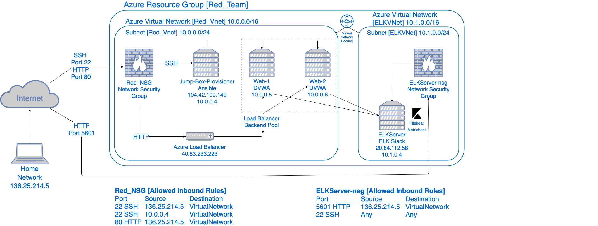
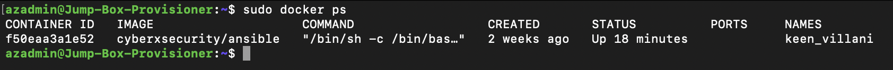

## Automated ELK Stack Deployment

The files in this repository were used to configure the network depicted below.

These files have been tested and used to generate a live ELK deployment on Azure. They can be used to either recreate the entire deployment pictured above.
Alternatively, select portions of the YAML file may be used to install only certain pieces of it, such as Filebeat.

  - [ELK Install Playbook](https://github.com/Jay247x/CSBC/blob/main/Ansible/install-elk.yml)
  - [Filebeat Playbook](https://github.com/Jay247x/CSBC/blob/main/Ansible/filebeat-playbook.yml)
  - [Metricbeat Playbook](https://github.com/Jay247x/CSBC/blob/main/Ansible/metricbeat-playbook.yml)

This document contains the following details:
- Description of the Topology
- Access Policies
- ELK Configuration
  - Beats in Use
  - Machines Being Monitored
- How to Use the Ansible Build

### Description of the Topology

The main purpose of this network is to expose a load-balanced and monitored instance of DVWA, the D*mn Vulnerable Web Application.

Load balancing ensures that the application will be highly available, in addition to restricting unauthorized access to the network.
The load balancers off-loading function also defends a network againsts distributed denial-of-service (DDoS) attacks.
The advantage of using a jump box is to establish a clear channel which can be used to access a network without multiple log-ins once an admin is within the network.
In addition to ease of access once authorized, a jump box aids in compliance and regulation matters as well as providing clear audit logs.

Integrating an ELK server allows users to easily monitor the vulnerable VMs for changes to the event logs and system metrics.
- Filebeat watches for changes in the log files for locations that an admin specifies. It also collects log events and forwards them for indexing.
- Metricbeat periodically collects and records metrics from the operating system and services running on the server, including CPU up time, memory usage, and data related to other services.

The configuration details of each machine may be found below.

| Name      | Function   | IP Address | Operating System     |
|-----------|------------|------------|----------------------|
| Jump-Box  | Gateway    | 10.0.0.4   | Linux (ubuntu 18.04) |
| Web-1     | Webserver  | 10.0.0.5   | Linux (ubuntu 18.04) |
| Web-2     | Webserver  | 10.0.0.6   | Linux (ubuntu 18.04) |
| ELKServer | Monitoring | 10.1.0.4   | Linux (ubuntu 18.04) |

### Access Policies

The machines on the internal network are not exposed to the public Internet.

Only the Jump-Box and ElkServer machine can accept connections from the Internet. Access to this machine is only allowed from the following IP addresses:
- 136.25.214.5

Machines within the network can only be accessed by the Jump-Box.
- My Home Network is allowed to access the ELKServer from IP Address 136.25.214.5

A summary of the access policies in place can be found in the table below.

| Name      | Publicly Accessible | Allowed IP Addresses |
|-----------|---------------------|----------------------|
| Jump-Box  | Yes                 | 136.25.214.5         |
| Web-1     | No                  | 10.0.0.4             |
| Web-2     | No                  | 10.0.0.4             |
| ELKServer | Yes                 | 136.25.214.5         |

### Elk Configuration

Ansible was used to automate configuration of the ELK machine. No configuration was performed manually, which is advantageous because it is scalable and avoids human error.

The playbook implements the following tasks:
- First, 'docker.io' and 'python3-pip' are installed using the apt module.
- Second, the 'docker module' is installed using the pip3 module.
- Next, the playbook increases the virtual memory using the command module and tells the VM to use more memory using the sysctl module so the ELK server can function properly.
- Then, the 'docker elk container' is downloaded and launched using the docker container module and ports that ELK runs on are published.
- Finally, using the systemd module the playbook enables the docker service when the system starts.

The following screenshot displays the result of running `docker ps` after successfully configuring the ELK instance.

### Target Machines & Beats
This ELK server is configured to monitor the following machines:
- 10.0.0.5 [Web-1]
- 10.0.0.6 [Web-2]

We have installed the following Beats on these machines:
- Filebeat
- Metricbeat

These Beats allow us to collect the following information from each machine:
- Filebeat collects log events by monitoring log files or specified locations. For example, 'faillog' containts information on all failed login attempts.
- Metricbeat collects metric data from target servers. For example, metricbeat collects operating system metrics and statistics such as CPU usage.

### Using the Playbook
In order to use the playbook, you will need to have an Ansible control node already configured. Assuming you have such a control node provisioned: 

SSH into the control node and follow the steps below:
- Copy the install-elk.yml file to /etc/ansible/roles/files.
- Update the /etc/ansible/hosts file to include the ELK server private IP and ansible_python_interpreter=/usr/bin/python3 under the elk group.
- Run the playbook, and navigate to the ELK VM public IP (http://20.84.112.58:5601) to check that the installation worked as expected.
